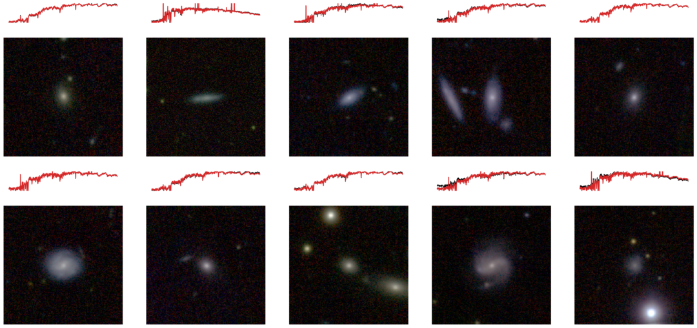

# Predicting galaxy spectra from images with hybrid convolutional neural networks
**Authors: John F. Wu ([@jwuphysics](https://github.com/jwuphysics/)) & Joshua E. G. Peek ([@jegpeek](https://github.com/jegpeek))**

See our workshop mini-paper on [arXiv](https://arxiv.org/abs/2009.12318) or check out the [poster](https://ml4physicalsciences.github.io/2020/files/NeurIPS_ML4PS_2020_3_poster.pdf) or [talk](https://www.youtube.com/watch?v=7dyncN1vKEE)! This work has been accepted to the [Machine Learning and the Physical Sciences](https://ml4physicalsciences.github.io/2020/) workshop at the 34th Conference on Neural Information Processing Systems ([NeurIPS 2020](https://neurips.cc/)).

Results can be seen in the example galaxies below. Given five-band Pan-STARRS imaging of a galaxy, our trained convolutional neural network can estimate the optical-wavelength spectrum (shown in red) remarkably close to the ground-truth SDSS spectrum (shown in black).




## Abstract

Galaxies can be described by features of their optical spectra such as oxygen emission lines, or morphological features such as spiral arms. Although spectroscopy provides a rich description of the physical processes that govern galaxy evolution, spectroscopic data are observationally expensive to obtain. For the first time, we are able to robustly predict galaxy spectra directly from broad-band imaging. We present a powerful new approach using a hybrid convolutional neural network with deconvolution instead of batch normalization; this hybrid CNN outperforms other models in our tests. The learned mapping between galaxy imaging and spectra will be transformative for future wide-field surveys, such as with the Vera C. Rubin Observatory and *Nancy Grace Roman Space Telescope*, by multiplying the scientific returns for spectroscopically-limited galaxy samples. 

## Code

### Prerequisites
In order to replicate our code, you will need `pytorch >= 1.4` and `fastai2` (the up-to-date library `fastai >= 2.0` may work but hasn't been tested). You will also need to install `astropy`, `astroML`, and `mish_cuda`, in addition to the Github repos mentioned below.

You may need to run `conda install pytorch==1.6.0 torchvision==0.7.0 cudatoolkit=10.1 -c pytorch`, while including the requirements `fastcore==0.1.39`, `fastai2==0.0.30`, and [`mish_cuda`](https://github.com/thomasbrandon/mish-cuda) (note that you may need to move a [file](https://github.com/thomasbrandon/mish-cuda/issues/9)).

Our work is based on [Portillo et al. (2020, AJ)](https://ui.adsabs.harvard.edu/abs/2020AJ....160...45P/abstract) [[Github repo](https://github.com/stephenportillo/SDSS-VAE)] and [Ye et al. (2020, ICLR)](https://openreview.net/forum?id=rkeu30EtvS) [[Github repo](https://github.com/yechengxi/deconvolution)]. Please see their code and corresponding papers for more details. We will also need to clone their repositories (clone [`SDSS-VAE`](https://github.com/stephenportillo/SDSS-VAE) into the root directory and [`deconvolution`](https://github.com/yechengxi/deconvolution) into `{ROOT}/src`). 

### Data
We use Pan-STARRS 1 (PS1) image cutouts hosted on the [Mikulski Archive for Space Telescopes](https://panstarrs.stsci.edu/) (see [example](ps1images.stsci.edu/)). Use the script `src/get_ps1_fits.py` to download each PS1 image in FITS format for the five channels (*grizy*) and combine them into a single `.npy` file. Default size is 224x224 pixels at 0.25 arcsec/pixel. These will be stored in the directory `{ROOT}/sdss_npy_images` by default.

The Sloan Digital Sky Survey (SDSS) spectra should be compressed and saved in the [SDSS-VAE repository](https://github.com/stephenportillo/SDSS-VAE).

The `xresnet18_hybrid` pretrained model can be downloaded [here](https://www.dropbox.com/s/9282jfj8ienxc7i/sdss64k-xresnet18_hybrid-neurips_10ep.pth?dl=0). You can also access the necessary files for [`sdss_64k.csv`](https://www.dropbox.com/s/tscw0n5la3d3nok/sdss_64k.csv?dl=0), [`latent_pca.pkl`](https://www.dropbox.com/s/445amn7gj2n6ibr/latent_pca.pkl?dl=0) and [`meanspec.npy`](https://www.dropbox.com/s/kpffqm9l87oeue1/meanspec.npy?dl=0).

### Results
Results can be recreated by running the `comparing-models.ipynb` notebook. 

Due to random initialization, loss values may differ slightly from ones presented in paper or poster. Also note that the paper reports mean squared error (MSE) loss, whereas the notebooks display root mean squared error (RMSE). 

## Citation

```
@ARTICLE{2020arXiv200912318W,
       author = {{Wu}, John F. and {Peek}, J.~E.~G.},
        title = "{Predicting galaxy spectra from images with hybrid convolutional neural networks}",
      journal = {arXiv e-prints},
     keywords = {Astrophysics - Instrumentation and Methods for Astrophysics, Astrophysics - Astrophysics of Galaxies, Computer Science - Computer Vision and Pattern Recognition, Computer Science - Machine Learning},
         year = 2020,
        month = sep,
          eid = {arXiv:2009.12318},
        pages = {arXiv:2009.12318},
archivePrefix = {arXiv},
       eprint = {2009.12318},
 primaryClass = {astro-ph.IM},
       adsurl = {https://ui.adsabs.harvard.edu/abs/2020arXiv200912318W},
      adsnote = {Provided by the SAO/NASA Astrophysics Data System}
}
```

## Acknowledgments

Thanks to Liza Sazonova (JHU) and Alex Gagliano (UIUC) for suggestions and fixes to the repository.
